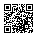

# Varlık Takip

**Varlık Takip**, kişi bazında sahip olduğunuz varlıkları ve bu varlıkların saklandığı yerleri düzenli şekilde takip etmenize yardımcı olan bir iOS uygulamasıdır.

## 📱 Uygulamayı indirin

Varlık Takip 1.1 özellikleri ve örnek ekranları: **[Uygulamanın güncel tanıtım sayfası](https://gururorkun.github.io/varlik-takip-privacy/app.html)**.

**1.1 Apple incelemesindedir.** Onaylanana kadar App Store'da 1.0 bulunur; onaylanan 1.1 otomatik yayımlanacaktır. 1.1; yenilenmiş ekranlar, isteğe bağlı Apple girişi ve özel iCloud çalışma alanı paylaşımı sunar. Yerel kayıtlar giriş yapınca otomatik buluta taşınmaz. **1.0'dan geçişte eski yerel veritabanı 1.1 çalışma alanına aktarılmaz; ilk 1.1 açılışında temizlenir.** Önemli kayıtları güncellemeden önce ayrıca not edin. Eski web adresleri güncel destek ve gizlilik sayfalarına yönlendirilir.

Varlık Takip artık App Store'da yayınlandı.

**[App Store'da Varlık Takip'i aç](https://apps.apple.com/app/id6814716446)**

QR kodu iPhone kamerasıyla tarayarak da uygulama sayfasına ulaşabilirsiniz:

  

## ✨ Öne çıkan özellikler

- 👤 Birden fazla kişi için ayrı varlık takibi
- 💰 Para, altın, menkul kıymet ve diğer varlık türleri
- 🏦 Banka / aracı kurum bilgileri
- 📱 Dijital platform ve fiziksel saklama yeri takibi
- 📊 Toplam varlık görünümü
- 📈 Varlık analizi
- 🕒 İşlem tarihçesi
- 🔎 Filtreleme ve arama
- 🔐 Yerel çalışma alanı hesap açmadan kullanılır

## 📋 Uygulama hakkında

Varlık Takip ile farklı kişilerin varlıklarını tek bir yerde kayıt altında tutabilir, aynı varlığın farklı kişilerdeki toplamını görebilir ve varlıkların saklama yerlerini takip edebilirsiniz.

Uygulama; yatırım işlemi veya para transferi gerçekleştirmez. Farklı para birimleri ve parasal olmayan varlıklar arasında otomatik kur dönüşümü veya parasal değerleme yapmaz.

## 🔒 Gizlilik

[Varlık Takip Gizlilik Politikası](https://gururorkun.github.io/varlik-takip-privacy/)

## 💬 Destek ve geri bildirim

[Varlık Takip Destek Sayfası](https://gururorkun.github.io/varlik-takip-privacy/support.html)

**E-posta:** g.o.urensel@hotmail.com

---

© 2026 Gurur Orkun Ürensel
